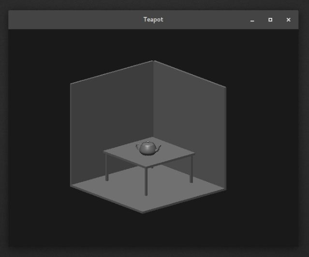

# Computer Graphics & Visualization Lab

## 1. Display a rectangular mesh
[Program](https://github.com/kienme/CGVLab/blob/master/01_mesh.cpp)  
### Output


## 2. Recursively subdivide a tetrahedron to form a 3D Sierpinski gasket
[Program](https://github.com/kienme/CGVLab/blob/master/02_gasket.cpp)  
### Output


## 3. Implement Cohen-Sutherland line clipping algorithm
[Program](https://github.com/kienme/CGVLab/blob/master/03_cohen.cpp)  
### Output


## 4. Implement Liang-Barsky line clipping algorithm
[Program](https://github.com/kienme/CGVLab/blob/master/04_liang.cpp)  
### Output


## 5. Fill a polygon using scan-line area filling algorithm
[Program](https://github.com/kienme/CGVLab/blob/master/05_scan.cpp)  
### Output


## 6. Create a cylinder and a parallelepiped by extruding a circle and a quadrilateral respectively
[Program](https://github.com/kienme/CGVLab/blob/master/06_cylinder.cpp)  
### Output


## 7. Create a house like figure and rotate it about a given fixed point using OpenGL functions
[Program](https://github.com/kienme/CGVLab/blob/master/07_house.cpp)  
### Output


## 8. Draw a color cube and spin it using OpenGL transformation matrices
[Program](https://github.com/kienme/CGVLab/blob/master/08_spincube.cpp)  
### Output


## 9. Draw a color cube and allow the user to move the camera to experiment with perspective viewing
[Program](https://github.com/kienme/CGVLab/blob/master/09_camcube.cpp)  
### Output


## 10. Draw a simple shaded scene consisting of a tea pot on a table
[Program](https://github.com/kienme/CGVLab/blob/master/10_teapot.cpp)  
### Output


## Compile and run (Linux)
```
$ g++ 10_teapot.cpp -lGL -lGLU -lglut -o teapot
$ ./teapot
```
